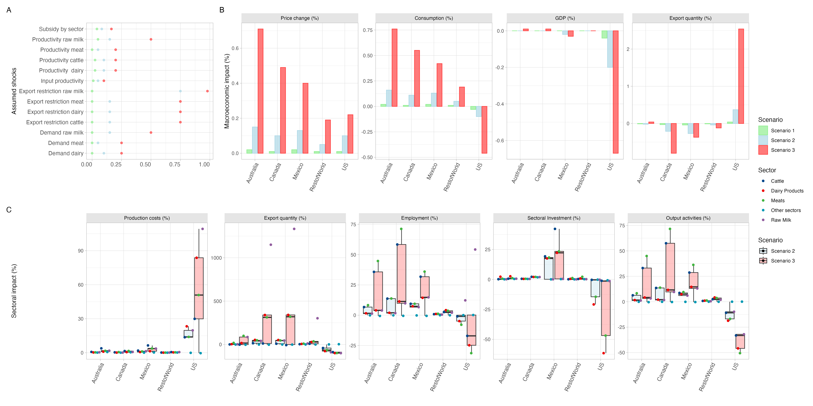

# The impact of H5N1 on US domestic and international dairy markets

## Abstract

The recent outbreak of H5N1 avian influenza in U.S. dairy cattle poses significant risks to public health, economic sustainability of farming,  and global food systems. Using a Computable General Equilibrium model, we assess short-to-medium-term impacts on GDP, trade, and employment under varying scenarios. We project economic losses ranging from $14bn to $164bn. Current government subsidies are about 1% of output losses, and likely insufficient to incentivise farmers to step up surveillance and biosecurity for mitigating the potential emergence of H5N1 strains with pandemic potential into human populations. 

## GTAP Model
We use the Global Trade Analysis Project (GTAP) model for this analysis. For more information, see GTAP website (https://www.gtap.agecon.purdue.edu/). This is a multi-region and multi-sector Computable General Equilibrium (CGE) model. We selected the GTAP model because it provides a more detailed description of the agricultural sector compared to other CGE models.

CGE models are economic tools that use real economic data to estimate how an economy might respond to changes in policy, technology, or external events, such as infectious disease outbreaks. They are also widely used to analyze the economic impacts of policy changes, including trade policies, tax reforms, and environmental regulations. This is a static comparative approach we aim to understand the imapct of H5N1 without describing the adjustement process.

Below are the steps to replicate our results. Only a basic understanding of GTAP is required. You can refer to Burfisher (2021) book "Introduction to Computable General Equilibrium Models" for a great introduction to RunGTAP.

After downloading and setting up RunGTAP and related software, you can implement our replication package (replicationH5N1.txt) using the GTAP model and RunGTAP:
    1-Use GTAPAgg2 to create an aggregation similar to the one displayed at the end of the replicationH5N1.txt file, section named "Aggregation GTAP 11B database".
    2-Update the version of RunGTAP to reflect this new aggregation by clicking on "Version" and selecting "New". Our modules are the same as Burfisher (2021) (GTAPUV7, etc.).
    3-Copy, paste, and run each scenario from the replicationH5N1.txt file into the Shock tab, one by one. Ensure you select the correct solution method, "Gragg", in the Solve tab, then click "Solve".
    4-Explore the results of each scenario individually using the Results tab.

## Post processing of GTAP model output

The output of the GTAP model is post-processed using R and the functions in `R\parse_GTAP_output.R`. We provide the model output in the `data` folder to reproduce Figure 2.

**Figure 2: Projections of the economic impact of the H5N1 outbreak, % deviation from pre-outbreak values.** Panel A shows assumed shocks by sector and scenario (S1 ‘current situation’ green, S2 ‘realistic scenario’ blue, S3’reasonable worst case’ red), see table A4; Panel B shows aggregate shocks on prices, consumption, GDP, and exports (table A5); Panel C shows sectoral shocks on prices, trade balance (positive: increase in export demand, negative: decrease in export demand), employment, investments and sectoral outputs (tables A6-A10); shown are point estimates for S1 and S2, and interquartile and total ranges of estimates for S3.
